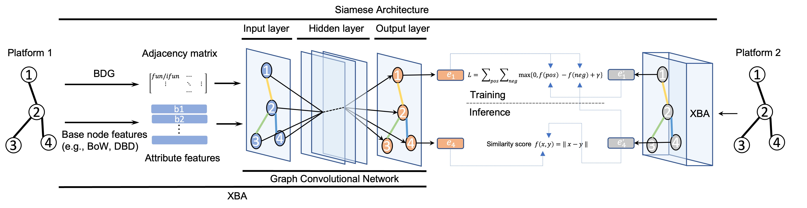

# XBA
This repository implements XBA, a deep learning tool for generating platform-agnostic binary code embeddings. XBA applies Graph Convolutional Network (GCN) on the graph representation of binary which we call Binary Disassembly Graph (BDG). XBA can learn semantic matchings of binary code compiled for different platfroms that are not included in the training dataset. It outperformed prior works in aligning binary code blocks for different platforms, that shows the embeddings generated by XBA can be used in the cross binary analysis.



## Getting Started
### Structure
The working directory should be structured as follows.

    .
    ├── README
    ├── Pipfile                 # Manages a Python virtualenv.
    ├── Pipfile.lock            # Manages a Python virtualenv (Do not touch).
    ├── baseline.py             # Calculate the hit score of baselines (BoW, DeepBinDiff, InnerEye).
    ├── get_rank.py             # Calculate individual rankings of binary code block pairs.
    ├── layers.py               # Define the graph convolution layer.
    ├── metrics.py              # Define the margin-based hinge loss function and hit score calculation.
    ├── models.py               # Define a tensorflow implementation of XBA.
    ├── train_general.py        # Train the model on the whole training dataset across binaries
    ├── train.py                # Train the model.
    ├── utils.py                # Define utility functions.
    ├── xba.py                  # This file defines XBA class that wraps tensorflow specific code for data load, training, validation, test.
    ├── script                  # Includes script files that can reproduce experiments presented in the paper.
    │   ├── table{x}-..         # Reproduce results of the table {x}.
    │   └── test-run.sh         # Test run XBA with 10 epochs for each dataset.
    ├── result                  # Default directory that the hit scores are stored.
    │   └── ...                 #
    ├── history                 # Default directory that the history of training is stored.
    │   └── ...                 #
    ├── data_processing         # 
    │   ├── build_vocab.py      # Build a vocabulary for generating BoW features.
    │   └── split_seed_alignments.py      # Split the training data and test data so that experiment results are deterministic.
    ├── data                    # Graph data for each binary.
    │   ├── curl                # 
    │   │   ├── seed_alignments                # Default directory for split_seed_alignments.py that randomly split alignment.csv into the test data and training data. 
    │   │   ├── alignment.csv                # Pair-wise-labeled data
    │   │   ├── deepbindiff_embeddings.pt                # DeepBinDiff embeddings for binary code blocks.
    │   │   ├── disasm_innereye.json                # Binary code blocks used to generate InnerEye embeddings.
    │   │   ├── disasm.json                # Binary code blocks used to generate DeepBinDiff, BoW, and XBA.
    │   │   ├── extfuncs.json                # 
    │   │   ├── gcn1-relation.csv                # Relation list of graph generated from a binary for Linux
    │   │   ├── gcn2-relation.csv                # Relation list of graph generated from a binary for Windows
    │   │   ├── innereye_embeddings_{curl_openssl_httpd_sqlite3_libcrypto}.pt                # Innereye embedding generated by training on labeled pairs from curl, openssl, httpd, sqlite3, and libcrypto.
    │   │   ├── innereye.csv                # alignment.csv for training InnerEye (This is not used in XBA)
    │   │   ├── mapping.csv                #
    │   │   └── subgraph.pth                #
    │   ├── httpd               # 
    │   ├── libc                # Graph 1 is generated from a binary for x86 and graph 2 is generated from a binary for arm.
    │   ├── libcrypto           # 
    │   ├── libcrypto-xarch     # Graph 1 is generated from a binary for x86 and graph 2 is generated from a binary for arm.
    │   ├── openssl             # 
    │   └── sqlite3             # 
    ├── vocabulary              # Default directory for storing generated vocabulary by build_vocab.py.
    └── saved_model             # Default directory for storing model parameters.  

### Install
#### Prerequisite
Python 3.8 or above version is required. We recommand using Nvidia GPU for training and exhaustive comparison for validation. To install python depedencies, you need to install pipenv first.
```shellsciprt
$ pip3 install pipenv
```

#### Use pipenv shell

Install dependencies
```shellscript
$ pipenv install
```

Activate pipenv shell
```shellscript
$ pipenv shell
```

#### Use your own Python virtual environment

Extract requirements.txt
```shellscript
$ pipenv lock -r > requirements.txt
```

Install dependencies
```shellscript
$ pip install -r requirements.txt
```

After activate the python virtual environment, you should be able to run any commands or scripts presented below.

### Dataset
For XBA to learn useful embeddings, software composing our training dataset must have (i) multi-platform support and (ii) platform-specific code blocks. We chose open-source software from the top Github repositories that are widely-used and satisfy the criteria. Selected software covers a broad range of software disciplines; SQLite3 (database), OpenSSL (network), cURL (file transfer), Httpd (web server), libcrypto (crypto library), glibc (standard library). We used IDA pro to extract the graph representation of each binary that is stored in `data` directory.

If users want to run XBA on different binaries, they have to first convert a binary into a proper input format (*i.e.*, Binary Disassembly Graph) that is specified in the paper and structure it like the above `data` directory structure.

XBA basically requires users to specify the proportion of the dataset to be included in the train split. To make this split deterministic, we first split the dataset and store the train split and test split seperately. Below command will do this for you. You will only need this command if you newly add dataset. As a dafult, we have split our dataset with a ratio of 10/20/30/40/50%.
```shellscript
$ python split_seed_alignments.py --target libcrypto
```
 
### Test run
To test basic funtionality, run the following command.
```shellscript
$ make test
```
It will run the training with BoW and DeepBinDiff base features for each binary in our dataset with 10 epochs and make a validation (approximately it takes around 20 minutes with one GPU). The half of the labeled data is used for training and the another half is for validation. After each training finishes, you will see outputs of hit scores with the validation data as below. Note that the score is not high enough since 10 epoch is not enough to train GCN.
**outputs**
```
...

INFO:root:Epoch: 0001 attribute_embeddings_train_loss=2.56452
INFO:root:Epoch: 0002 attribute_embeddings_train_loss=2.24075
INFO:root:Epoch: 0003 attribute_embeddings_train_loss=1.83440INFO:root:Epoch: 0004 attribute_embeddings_train_loss=1.37844INFO:root:Epoch: 0005 attribute_embeddings_train_loss=0.97964
INFO:root:Epoch: 0006 attribute_embeddings_train_loss=0.70114
INFO:root:Epoch: 0007 attribute_embeddings_train_loss=0.53227
INFO:root:Epoch: 0008 attribute_embeddings_train_loss=0.43258
INFO:root:Epoch: 0009 attribute_embeddings_train_loss=0.36502
INFO:root:Epoch: 0010 attribute_embeddings_train_loss=0.31294
INFO:root:model saved in ./saved_model/gcn-5layer-httpd-deepbindiff-seed50-epoch10-D200-gamma3.0-k1-dropout0.0-LR0.001
INFO:root:Optimization Finished!
INFO:root:gcn-5layer-httpd-deepbindiff-seed50-epoch10-D200-gamma3.0-k1-dropout0.0-LR0.001
INFO:root:<Attribute embeddings>
INFO:root:For each left:
INFO:root:Hits@1: 45.76%
INFO:root:Hits@10: 65.14%
INFO:root:Hits@50: 76.32%
INFO:root:Hits@100: 81.33%
INFO:root:For each right:
INFO:root:Hits@1: 47.81%
INFO:root:Hits@10: 66.17%
INFO:root:Hits@50: 77.70%
INFO:root:Hits@100: 82.78%

...
```


## Detailed Description

### XBA class
`xba.py` defines the main class of XBA.

### Training
The main training script is `train.py` and it needs the following parameters.

* target
* embedding_type
* learning_rate
* epochs
* dropout
* gamma
* k
* layer
* ae_dim
* seed
* log
* record
* restore
* validate

```Python

xba = XBA(
    FLAGS.target, FLAGS.embedding_type, FLAGS.learning_rate, FLAGS.epochs, FLAGS.dropout, FLAGS.gamma,
    FLAGS.k, FLAGS.layer, FLAGS.ae_dim, FLAGS.seed, FLAGS.log, FLAGS.record,
)

(
    adjacency_matrix_tuple,
    embeddings_tuple,
    train_data,
    test_data,
    embeddings_mat,
) = xba.data_load()

(placeholders, model) = xba.build_model(embeddings_tuple, train_data)

xba.train(
    adjacency_matrix_tuple, embeddings_tuple, train_data, test_data,
    embeddings_mat, placeholders, model, validate=FLAGS.validate, restore=FLAGS.restore,
)
```


### Exaustive Comparisons

### OOD Alignment Predictions

### Indivisual Comparisons


## How to run


Training GCN model on {target} based on {embedding_type} with 10/20/30/40/50% seed alignments and store models in `saved_model`. Results will be stored in `result` directory in root directory.
```shellscript
$ pipenv run -- python train.py --target {target} --embedding_type {embedding_type} --seed {1|2|3|4|5} --log warning
```

Run baseline (matching only with BB attribute features)
```shellscript
$ pipenv run -- python baseline.py --target{target} --embedding_type {embedding_type} --log warning --seed {1|2|3|4|5}
```

Calculate the ranking of indivisual block pairs which did not appeared in seed alignment using fully trained (100% seed alignments) gcn model.
```shellscript
$ pipenv run -- python get_rank.py --target {target} --embedding_type {embedding_type} --log warning --bb_id1="{block id list}" --bb_id2="{block id list}"
```


## Citation
```
TBA
```