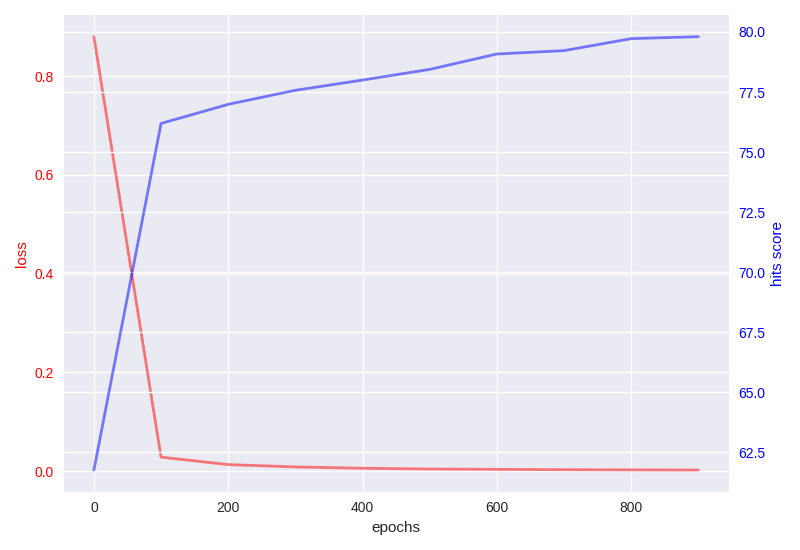

# XBA
This repository implements XBA, a deep learning tool for generating platform-agnostic binary code embeddings. XBA applies Graph Convolutional Network (GCN) on the graph representation of binary which we call Binary Disassembly Graph (BDG). XBA can learn semantic matchings of binary code compiled for different platforms that are not included in the training dataset. It outperformed prior works in aligning binary code blocks for different platforms, which shows the embeddings generated by XBA indeed are useful in the cross binary analysis. XBA is implemented with Python v3.8 and Tensorflow v2.7.0. Our GCN implementation is based on this [repository](https://github.com/1049451037/GCN-Align).


## Getting Started
After cloning the repository, make sure you unzip `XBA/data/done/libcrypto/deepbindiff_embeddings.pt.tar.gz` in the same directory.

### Directory Structure
The working directory should be structured as follows.

    .
    ├── README
    ├── Pipfile                 # Manages a Python virtualenv.
    ├── Pipfile.lock            # Manages a Python virtualenv (Do not touch).
    ├── baseline.py             # Calculate the hit score of baselines (BoW, DeepBinDiff, InnerEye).
    ├── get_rank.py             # Calculate individual rankings of binary code block pairs.
    ├── layers.py               # Define the graph convolution layer.
    ├── metrics.py              # Define the margin-based hinge loss function and hit score calculation.
    ├── models.py               # Define the tensorflow implementation of XBA.
    ├── train.py                # Train the model.
    ├── utils.py                # Define utility functions.
    ├── xba.py                  # This file defines XBA class that wraps the tensorflow-specific code for data load, training, validation, and test.
    ├── script                  # Includes script files that can reproduce experiments presented in the paper.
    │   ├── table{x}-..         # Reproduce results of the table {x}.
    │   └── test-run.sh         # Test run XBA with 10 epochs for each dataset.
    ├── result                  # Default directory where the hit scores are stored.
    │   └── ...                 
    ├── history                 # Default directory where the history of training is stored.
    │   └── ...                 
    ├── data_processing          
    │   ├── build_vocab.py      # Build a vocabulary for generating BoW features.
    │   └── split_seed_alignments.py      # Split the training data and test data so that experiment results are deterministic.
    ├── data/done                    # Preprocessed graph representation data for each binary.
    │   ├── curl                 
    │   │   ├── seed_alignments                # Default directory for split_seed_alignments.py
    │   │   ├── alignment.csv                  # Pair-wise-labeled data
    │   │   ├── deepbindiff_embeddings.pt      # DeepBinDiff embeddings for binary code blocks.
    │   │   ├── disasm_innereye.json           # Binary code blocks used to generate InnerEye embeddings.
    │   │   ├── disasm.json                    # Binary code blocks used to generate DeepBinDiff, BoW, and XBA.
    │   │   ├── extfuncs.json                  
    │   │   ├── gcn1-relation.csv              # Relation list of a graph generated from a binary compiled for Linux
    │   │   ├── gcn2-relation.csv              # Relation list of a graph generated from a binary compiled for Windows
    │   │   ├── innereye_embeddings_{curl_openssl_httpd_sqlite3_libcrypto}.pt                # Innereye embedding generated by training on labeled pairs from cURL, OpenSSL, Httpd, SQLite3, and libcrypto.
    │   │   ├── innereye.csv                   # alignment.csv for training InnerEye (This is not used in XBA)
    │   │   ├── mapping.csv                    
    │   │   └── subgraph.pth                   
    │   ├── httpd                               
    │   │   └── ...                            # The same structure with curl
    │   ├── libc                               # Graph 1 is generated from a binary compiled for x86 and graph 2 is generated from a binary compiled for ARM.
    │   │   └── ...                            # The same structure with curl
    │   ├── libcrypto                          
    │   │   └── ...                            # The same structure with curl
    │   ├── libcrypto-xarch                    # Graph 1 is generated from a binary compiled for x86 and graph 2 is generated from a binary compiled for ARM.
    │   │   └── ...                            # The same structure with curl
    │   ├── openssl                             
    │   │   └── ...                            # The same structure with curl
    │   └── sqlite3                             
    │       └── ...                            # The same structure with curl
    ├── vocabulary              # Default directory for storing generated vocabulary by build_vocab.py.
    └── saved_model             # Default directory for storing model parameters.  

### Install
#### Targeted environment
XBA runs on Linux and at least one Nvidia GPU is required for training and hit score calculations for validation. For NVidia GPU support, you must first install CUDA and CuDNN, if they have not already been installed. We tested XBA on Ubuntu 18.04.5 LTS with a machine equipped with AMD EPYC 7282 CPU with 256GB
RAM and two NVIDIA RTX 3090 GPUs. Each GPU is used for training and hit score calculations.

#### Prerequisite
Python 3.8 or above version is required. To install python dependencies, you need to install pipenv first.
```shellscript
$ pip3 install pipenv
```

#### Use pipenv shell

Install dependencies
```shellscript
$ pipenv install
```

Activate pipenv shell
```shellscript
$ pipenv shell
```

#### Use your own python virtual environment

Extract requirements.txt
```shellscript
$ pipenv lock -r > requirements.txt
```

Install dependencies
```shellscript
$ pip install -r requirements.txt
```

After activating the python virtual environment, you should be able to run any commands or scripts presented below. Note that XBA uses a few deprecated TF1 APIs that does support the eager execution of TF2. While we are still investigating a good candidate for the deep learning library of XBA, the issue will be resolved in the future.

### Dataset
For XBA to learn useful embeddings, software composing our training dataset must have (i) multi-platform support and (ii) platform-specific code blocks. We chose open-source software from the top Github repositories that are widely used and satisfy the criteria. Selected software covers a broad range of software disciplines; *SQLite3* (database), *OpenSSL* (network), *cURL* (file transfer), *Httpd* (webserver), *libcrypto* (crypto library), *glibc* (standard library). We used IDA Pro to extract the graph representations of each binary and stored them in the `data` directory.

If users want to run XBA on different binaries, they have to first convert a binary into a proper input format (*i.e.*, Binary Disassembly Graph) that is specified in the paper. Required files for binary disassembly graph should be structured like the above `data` directory structure. The data preprocessing is quite tricky here and we do not provide functionality for the data preprocessing. Thus we recommend you start with and be familiar with the data that we've already preprocessed and put in the `data` directory.

After preprocessing the graph data into a proper format you should first split the pair-wise-labeled data manually. XBA basically requires users to specify the proportion of the dataset to be included in the train split. To make this split deterministic, users should split the dataset in advance and store the train split and test split separately. The below command will do this for you. You would only need this command if you newly added a dataset. By default, we have split our dataset with a ratio of 10/20/30/40/50%.
```shellscript
$ python split_seed_alignments.py --target {target program name}
```

### Environment variable
`HIT_SCORE_GPU_ID`: there are two computationally expensive operations in XBA; training and hit score calculation. You can move the hit score calculation to another GPU by specifying an id with `HIT_SCORE_GPU_ID` environment variable. The default value is zero if there is GPU; otherwise, the CPU is used. 
 
### Test run
If you succeed to download the repository and set up a proper python environment you should be able to test every functionality that XBA provides. To test basic functionality, run the following command.
```shellscript
$ make test
```
This will run the training with BoW and DeepBinDiff base features for each binary in our dataset with 10 epochs and make a validation (approximately it takes around 20 minutes with one RTX 3090). Half of the labeled data is used for training and another half is for validation. After each training finishes, you will see outputs of hit scores as below. Note that the score is not high enough since mostly 10 epochs are not enough to train multi-layer GCN.

**outputs**
```
...

INFO:root:Epoch: 0001 attribute_embeddings_train_loss=2.56452
INFO:root:Epoch: 0002 attribute_embeddings_train_loss=2.24075
INFO:root:Epoch: 0003 attribute_embeddings_train_loss=1.83440
INFO:root:Epoch: 0004 attribute_embeddings_train_loss=1.37844
INFO:root:Epoch: 0005 attribute_embeddings_train_loss=0.97964
INFO:root:Epoch: 0006 attribute_embeddings_train_loss=0.70114
INFO:root:Epoch: 0007 attribute_embeddings_train_loss=0.53227
INFO:root:Epoch: 0008 attribute_embeddings_train_loss=0.43258
INFO:root:Epoch: 0009 attribute_embeddings_train_loss=0.36502
INFO:root:Epoch: 0010 attribute_embeddings_train_loss=0.31294
INFO:root:model saved in ./saved_model/gcn-5layer-httpd-deepbindiff-seed50-epoch10-D200-gamma3.0-k1-dropout0.0-LR0.001
INFO:root:Optimization Finished!
INFO:root:gcn-5layer-httpd-deepbindiff-seed50-epoch10-D200-gamma3.0-k1-dropout0.0-LR0.001
INFO:root:<Attribute embeddings>
INFO:root:For each left:
INFO:root:Hits@1: 45.76%
INFO:root:Hits@10: 65.14%
INFO:root:Hits@50: 76.32%
INFO:root:Hits@100: 81.33%
INFO:root:For each right:
INFO:root:Hits@1: 47.81%
INFO:root:Hits@10: 66.17%
INFO:root:Hits@50: 77.70%
INFO:root:Hits@100: 82.78%

...
```

After the training, the model parameters are saved by TensorFlow *Saver* and it can be easily restored and utilized again with the given python code, `test.py`. By default, the model parameters are saved in the `saved_model` directory and have the following file name format.
```
"gcn-{the number of layers}layer-{target program name}-{embedding type}-seed{proportion of seed alignment}-epoch{the number of epochs}-D{self.ae_dim}-gamma{gamma}-k{k}-dropout{dropout}-LR{lr}"
```


## Detailed Description

### XBA class
`xba.py` defines the main class of XBA. It implements the core functionalities of XBA including training, validation, data loading, and building the model. To use XBA, users should first instantiate this class and further functionalities are provided as methods of XBA class. In this way, they can use XBA as it is implemented. If users want to make specific changes in implementations such as modifying tensorflow training code or changing the model architecture, `xba.py` is a good starting point to take a look.

### Training
The main training script is `train.py` and it needs the following parameters.

* `target`: A name of target binary for training. Data will be loaded from `./data/{target}/`. *cURL*, *Httpd*, *libc*, *libcrypto*, *libcrypto-xarch*, *OpenSSL*, *sqlite3* are available currently.
* `embedding_type`: A type of base feature of binary code blocks that will be an input of the first layer of GCN. BoW and DeepBinDiff are available currently.
* `learning_rate`: A hyperparameter for the Adam optimizer. The default value is 1e-03.
* `epochs`: The epoch number of training. Note that the batch size is 1 by default, so there is one iteration per epoch.
* `dropout`: A hyperparameter for the training. 0 by default.
* `gamma`: A hyperparameter for the margin-based hinge loss.
* `k`: The number of negative samples per positive pair.
* `layer`: The number of GCN layers that XBA uses.
* `ae_dim`: The dimension of output embedding. By default, it is set to 200.
* `seed`: A proportion of the dataset to be included in the train split. For example, if it is 3 then 30% of the data will be used for training.
* `log`: Default python logging level. A default value is *INFO*.
* `record`: Record history of training in the `history` directory and the hit scores in the `result` directory.
* `restore`: Before training, restore the parameters to continue training.
* `validate`: Validation after the training.

The following code snippet trains XBA on {`target`} data with {`embedding_type`} features. {`seed`}% seed alignments are used for training and after finishing training the model parameters are stored in the `saved_model` directory. When instantiating XBA class, users should put hyperparameters for the training that will also be used for all afterward operations with the class. Having the XBA class instantiated with proper hyperparameters, the first thing user can do is loading data. Users can load the data that we've already preprocessed with a single line of code. The return values of `data_load()` are as follow:

* adjacency_matrix_tuple: this is an adjacency matric in COOrdinate format. Each entry is calculated based on fun/ifun of edges in the graph, which is explained in our paper.
* embeddings_tuple, embeddings_mat: these are base features of all nodes in the graph. It is generated by the method specified by the `embedding_type` parameter.
* test_data, train_data: lists of labeled data

`build_model()` builds the GCN model and `train()` gets the data and model as inputs to train the model.

```Python

xba = XBA(
    target, embedding_type, learning_rate, epochs, dropout, FLAGS.gamma,
    k, layer, ae_dim, seed, log, record,
)

adjacency_matrix_tuple, embeddings_tuple, train_data, test_data, embeddings_mat = xba.data_load()

placeholders, model = xba.build_model(embeddings_tuple, train_data)

xba.train(
    adjacency_matrix_tuple, train_data, test_data,
    embeddings_mat, placeholders, model, validate=FLAGS.validate, restore=FLAGS.restore,
)
```

If `record` is set to True, then after the training, the history of hit scores and the value of loss function are stored in the `history` directory. The current period of recording is 100 epochs. A sample history is as follows.
```
{"epoch": [0, 100, 200, 300, 400, 500, 600, 700, 800, 900], "loss": ["0.87975836", "0.028531872", "0.013416106", "0.008701273", "0.0060030213", "0.0044472036", "0.0037757999", "0.0030763736", "0.0026834046", "0.002365994"], "hits": ["61.75739713361072", "76.1904761904762", "76.98653490522423", "77.57165973185391", "77.99786176606564", "78.44284558483588", "79.08287101248266", "79.22445677300047", "79.72289644012946", "79.8052473416551"]}
```



If `validate` is set to True, the hit scores are calculated using test data after the training. The hit scores will be stored in the `result` directory if `record` is set to True. The sample output of hit scores is as follows.
```
Hits,AB,BA
1,85.21863641370196,87.63630355766054
10,90.99570437272827,92.15772662187466
50,97.18030620112347,94.34959797334508
100,97.76957814737305,98.33131402136799
```
We used *Hits@k* scores as the main measurement for performance. It counts the number of correctly aligned entities ranked in the top *k* candidates. The first column contains *k*. The second and third columns specify the corresponding hits scores in both directions.

### Indivisual Comparisons
To calculate the ranking of indivisual block pairs which do not appear in seed alignment, you can use `get_rank.py`. It receives lists of basic blocks and conduct a exhaustive comparison between them. For example,

```shellscript
$ python ./src/get_rank.py --layer 5 --k 25 --seed 10 --learning_rate 0.001 --gamma 3 --epochs 200 --ae_dim 200 --target libcrypto-xarch --embedding_type bow --bb_id1="93448, 93449" --bb_id2="197104, 197105" # aesni_gcm_initkey
```

With this command, you can calculate the ranking of individual blocks that are included in *libcrypto-xarch*. Note that before doing this, the corresponding model should be trained. The output will be like the below.
```
BB ID 1,BB ID 2,AB,BA
93448,197104,161,39
93448,197105,17,36
93449,197104,15346,1064
93449,197105,1683,189
```

### Baseline
Run the baseline with {*embedding type*} feature on {*target program name*} (*i.e.*, matching only with BB attribute features).
```shellscript
$ python ./src/baseline.py --target {target program name} --embedding_type {embedding type}
```


### Reproduce experiment results in the paper
For convenience, we wrote scripts for reproducing the experimental results presented in the paper. The below commands will do it for you.

**With training**
```shellscript
$ make table6
$ make table7
$ make table8
$ make figure3
```

**Without training**
```shellscript
$ make test-table6
$ make test-table7
$ make test-table8
$ make figure3
```

## Apply XBA to other binaries
As noted above, we do not provide the data generation functionality since it requires the licensed IDA Pro. Specifically, We utilized IDAPython to extract a list of basic blocks and the relational information between the basic blocks. Each instruction in basic blocks should be normalized following the rules specified in the paper. The extracted data should be properly arranged under a directory `./data/{binary_name}`. The required data files are as follows.
* alignment.csv: this file contains a list of alignment information between a pair of basic blocks that match the same source code line.
* deepbindiff_embeddings.pt: deepbindiff embedding generated by running deepbindiff on the same binary
* disasm.json: a list of basic blocks with their content
* gcn1-relation.csv: the relation list of a binary compiled for the first targeted platform
* gcn2-relation.csv: the relation list of a binary compiled for the second targeted platform
* innereye_embeddings: a list of basic block embeddings generated by running InnerEye on the same binary

Additionally, if you were to use BoW base features, then you would have to extract vocabulary first from the target binary. We provide a script (`./data_processing/build_vocab.py`) for this.
* ./vocabulary/{binary_name}.json: a list of vocabulary that appears in the target binary disassembly code.


You can specify the name of the target binary on which you want to apply XBA with other hyperparameters when instantiating the XBA class
```Python
xba = XBA(
    {binary_name}, embedding_type, learning_rate, epochs, dropout, FLAGS.gamma,
    k, layer, ae_dim, seed, log, record,
)
```

## Troubleshooting

### The TensorFlow library was compiled to use AVX instructions, but these aren't available on your machine.
This error comes out because your CPU does not support AVX instructions. You need to compile the TensorFlow from the source code that does not use the AVX instruction set.

### Assertion fail (`assert success, f"Cannot find a trained model from {xba.get_model_path(' ')[0]}"`)
The assertion fails because XBA fails to restore the model weights. When the function, `sess, success = xba.restore()` is called, XBA restore the trained model weights from `saved_moel` directory. Therefore, the proper model should be already trained and the resultant weights should be stored in `saved_model` directory before running `get_rank.py` and `test.py`.


## Citation
```
@inproceedings{kim2022improving,
  title={Improving Cross-Platform Binary Analysis using Representation Learning via Graph Alignment},
  author={Kim, Geunwoo and Hong, Sanghyun and Michael, Franz and Song, Dokyung},
  booktitle={Proceedings of the 31st ACM SIGSOFT International Symposium on Software Testing and Analysis},
  year={2022}
}
```
